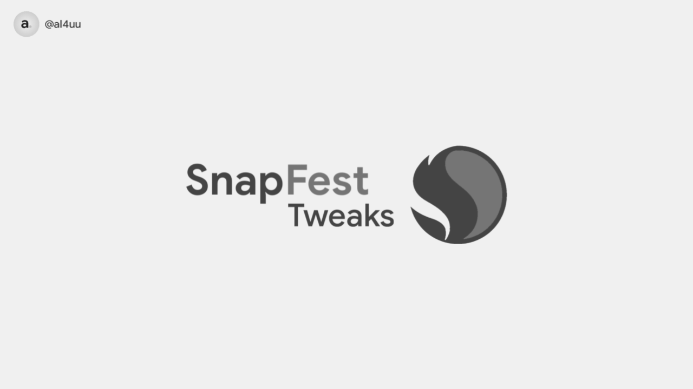

## Special performance module designed for Snapdragon devices !


## 🀄 SnapFest

</a>
<p>SnapFest is a performance module designed specifically for Snapdragon devices, the successor of Bumbu Racik. This module focuses on boosting speed, responsiveness, and overall device performance, making daily use and gaming smoother.</p>

## 📑 Notes
- Combine this module with [**Adreno GPU Drivers**](https://t.me/lhmodshare) for better performance.
- Use a **CLO/CAF-based** kernel to optimize performance (if available on your device).

## ❓ Requirements
- Basic knowledge of Android modifications.
- Android device with Root access **(Magisk/KernelSU/APatch)**.

## 🤓 Installation
1. Download the latest release from the [**Releases Page**](https://github.com/al4uu/snapfest/releases)
2. Install the module via **Magisk/KernelSU/APatch** Manager.
3. Reboot your device for the changes to take effect.

## 🤔 Changelogs
- Read full changelog [**here**](https://github.com/al4uu/snapfest/blob/fest/changelog.md)

## 🫱🏻‍🫲🏼 Contribution

<p>
If you're interested in contributing to or improving SnapFest, feel free to fork this repository and submit a pull request. We welcome suggestions, issues, and feedback to continuously enhance the module.
</p>

## 📋 License
This project is licensed under the **Apache License 2.0**. 
```text
Licensed under the Apache License, Version 2.0 (the "License");
you may not use this file except in compliance with the License.
You may obtain a copy of the License at

    http://www.apache.org/licenses/LICENSE-2.0

Unless required by applicable law or agreed to in writing, software
distributed under the License is distributed on an "AS IS" BASIS,
WITHOUT WARRANTIES OR CONDITIONS OF ANY KIND, either express or implied.
See the License for the specific language governing permissions and
limitations under the License.
